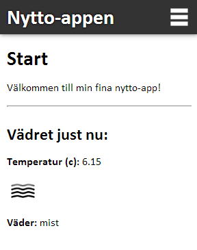
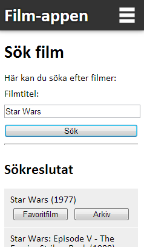
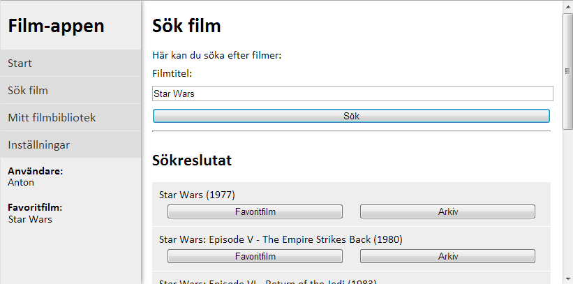
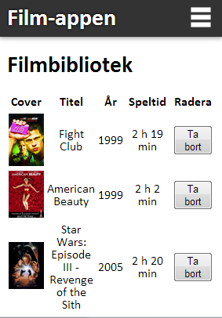
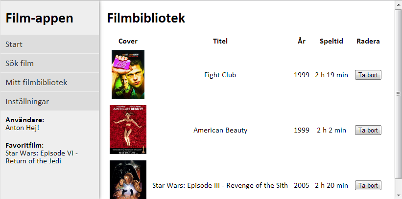

# Inlämningsuppgift 2: Ajax, media, m.m.

## 1. Inledning

I den andra inlämningsuppgiften ska vi fokusera på funktionalitet som ofta används i webbappar. Vi kommer främst att titta på hantering av externa API, samt hur vi kan lagra inforamtion kring detta hos klienten. Dessutom ska vi göra det möjligt för användaren att ladda upp media (bild, ljud, video), och sedan visa upp denna media enligt användarens önskemål. Slutligen ska vi även göra appen lättillgänglig för användarna genom att knyta en ikon till appen som visas om användaren bokmärker er webbplats på "skrivbordet" för iOS- och Android-enheter.

## 2. Syfte

Uppgiften har som syfte att bl.a. examinera följande punkter:

- Utökad kunskap om externa API, JSON & localStorage
- Utökad kunskap om att anpassa en webbplats för olika enheter genom CSS
- Utökad kunskap om JavaScript m.h.a. ramverket jQuery (och ev. andra ramverk)
- Utökad kunskap om CSS-ramverk
- Kunna utöka tillgänglighet kring en webbapp genom att knyta en "skrivbords"-ikon till er webbapp

**Vi ska i denna uppgift alltså använda oss utav ett ramverk (valfritt vilket) för att skapa vår responsiva webbplats. Exempel på ramver är [bootstrap](http://getbootstrap.com), [foundation](http://foundation.zurb.com) och [materialazeCSS](http://materializecss.com)**

## 3. Uppgiften

### 3.1. Layout i HTML/CSS

Första delen av uppgiften är att skapa en bra/tydlig layout för desktop, tablets och mobila enheter. Använd här ett externt CSS-ramerk för att åstakomma detta.

### 3.2. Visa aktuellt väder på startsidan **VG**

Er första funktion som ni ska implementera är att visa användaren vad det är för väder där han/hon befinner sig just nu. Detta genom att först ta reda på vår plats (genom HTML5 geolocation) och sedan genom ett valfritt väder API ta reda på:

- Aktuell temperatur (ska visas i celcius för användaren)
- En bild på det aktuella väderläget
- Beskrivning av det aktuella väderläget

Ni får som använda vilket API ni vill, men detta är ett förslag (enkelt att använda): [Open Weather Map](http://openweathermap.org/API)

*Exempel på utseende för mobiltelefon*

### 3.2. Funktion: Söka efter filmer

Ni ska i er app ha en sida där man kan söka efter filmer. Sökningen ska ske genom ajax till ett lämpligt API (jag rekommenderar detta: [omdbapi](http://www.omdbapi.com)). Resultatet av sökningen ska presenteras för användaren i form av:

- Titel på film
- Årtal på film

Det ska också visas två knappar vid varje film:

- "Favoritfilm" - Klickar man på denna ska användarens favoritfilm uppdateras till den film man klickade på (sparas i localStorage)
- "Arkiv" - Klickar man på denna ska filmen läggas till användarens arkiv och då visas när man går in på sidan "Mitt filmbibliotek" (sparas i localStorage)

*Exempellayout för mobil*

*Exempellayout för tablet*

**Observera** att bilderna ovan visar på *hur* webbplatsens layout/struktur ska vara, *inte* hur den grafiska formgivningen ska vara. Använd gärna en egen design på er sida.

### 3.2.3. **VG:** Funktion: Filmbibliotek

I filmbiblioteket ska användaren kunna spara (och ta bort) filmer i sitt filmbibliotek. Dessa filmerna ska finnas sparade i localStorage. Tips för att spara filmerna är att spara dem som JSON (då localStorage endast sparar text).

Egenskaper som ska visas för varje film är:

- Bild på film
- Titel
- År
- Speltid

Det ska också finnas en knapp för att ta bort filmer från ert filmarkiv.

*Exempellayout för mobil*

*Exempellayout för tablet*

### 3.3. Funktion: Fånga media

På denna sida ska vi fånga media från användarens enhet. Det vi ska fånga är antingen foto/ljud/video. Varje media ska ha en typ (audio/video/photo) och en titel (en sträng). Dessa ska sparas i databasen tillsammans med sökvägen för bilden/ljudklippet/videon). Media-objektet ska sparas på servern och informationen ska sparas i en MySQL-databas. Själva sparande sker genom PHP (*Vi kommer labba på detta i vecka 9). Formuläret ska skickas genom AJAX och lämpligt meddelande, samt hur feedback kring uppladdningen (t.ex. % klar av uppladdningen), ska visas så att användaren vet om media-objektet sparades eller inte. Efter lyckad uppladdning ska formuläret återställas.

Knappen som man klickar på ska vara någon av följande:

```html
<!-- Kamera -->
<input type="file" name="media" accept="image/*" capture="camera">
<!-- Ljud -->
<input type="file" name="media" accept="audio/*" capture="microphone">
<!-- Video -->
<input type="file" name="media" accept="video/*" capture="camcorder">
```

Detta beroende på vilken typ av media man väljer i drop-down-menyn.

### 3.4. Visa media

Sista delen innebär att vi ska visa den media som vi sparat på server i föregående steg. Vi vill på ett snyggt sätt kunna visa upp foto/video/ljudklipp för användaren. Förutom att visa media-objekten ska titeln för varje media-objekt också skrivas ut. Användaren ska även kunna välja om han/hon vill visa alla media-objekt eller endast foto/video/ljudklipp genom en drop-down-menu.

### 3.5. Spara webbappen på ikon på "skrivbordet"

Vi ska slutligen ge användaren möjlighet att spara er webbplats på sin startskärm för iOS och Android. Ni ska då se till att lämpligt app-namn och lämplig app-ikon visas på ett korrekt sätt. Ni kan läsa mer om detta på följande länkar:

- [https://developer.apple.com/library/ios/documentation/AppleApplications/Reference/SafariWebContent/ConfiguringWebApplications/ConfiguringWebApplications.html](https://developer.apple.com/library/ios/documentation/AppleApplications/Reference/SafariWebContent/ConfiguringWebApplications/ConfiguringWebApplications.html)
- [https://gigaom.com/2011/06/22/how-to-create-ios-device-home-screen-icons-for-web-sites/](https://gigaom.com/2011/06/22/how-to-create-ios-device-home-screen-icons-for-web-sites/)
- [https://developer.chrome.com/multidevice/android/installtohomescreen](https://developer.chrome.com/multidevice/android/installtohomescreen)

## Krav

### Generella krav

1. Er HTML- och CSS-kod ska validera enligt nuvarande standarder
2. Er JavaScript-kod ska köras utan några fel
3. Er HTML-kod ska vara bra skriven, tydlig, med rätt element för rätt innehåll
4. När man sparar något i er webbapp ska feedback ges till användaren
5. Om man inte har tillgång till internet ska ni meddela användaren om detta

### Funktionella krav

6. Layout
    - Er app ska vara anpassad för desktop, mobiltelefoner och tablets
    - Er app ska beté sig på ett bra sätt för olika skärmupplösningar (olika enheter)
    - Ni ska använda er utav ett CSS-ramverk för att skapa layouten på er webbplats
7. Funktion: Visa aktuellt väder **VG**
    - Ni ska använda er utav ett externt API för att hämta information om vädret
    - Ni ska använda Ajax för att genomföra och presentera resultatet vädersökningen
    - Ni ska skriva ut: Temperatur (celcius), visa bild & beskrivning på aktuellt väder
7. Funktion: Felhantering
    - Ni ska på ett snyggt och smidigt sätt berätta för användaren när appen är inte får korrekt svar från ajax-anrop
8. Funktion: Sök film
    - Ni ska använda er utav ett externt API för att hämta information om filmer/söka efter filmer
    - Ni ska använda Ajax för att genomföra och presentera resultatet av sökningen
    - Man ska kunna spara sökta filmer som 1) Favoritfilm och (för VG) i sitt filmbibliotek
9. Funktion: Filmbibliotek (för **VG**)
    - Filmerna ska sparas i "localStorage" (lämpligsvis genom JSON)
    - Man ska kunna lägga till/ta bort filmer
    - Filmerna ska visas med cover, titel, år, speltid
10. Funktion: Fånga media
    - Ni ska spara media-objektet (foto/film/video) på er server
    - Information om media-objetet (sökväg/titel/typ) ska sparas i en MySQL-databas
    - Formuläret ska skickas via AJAX
    - Användaren ska meddelas när objektet lyckats/misslyckats att laddas upp, genom lämpligt felmeddelande
    - När filen är uppladdad (lyckats) ska formläret återställas
11. Funktion: Visa media
    - Ni ska visa upp de media-objekt som är sparade på er server/i databasen på ett användarvänligt och smidigt sätt för användaren
    - Användaren ska kunna välja om han/hon vill se alla/foto/video/ljud-objekt i en drop-down lista
12. Funktion: Spara webbapp på "skrivbord"
    - Korrekt ikon och namn ska finnas när man sparar webbappen som bokmärkepå sitt "skrivbord" i iOS och Android

**I övrigt kommer den genomgående kvalitén att bedömas.**

## Redovisning

När ni är klara med en uppgift, dubbelkollat mot kravlistan och jämfört med videon ovan och allt ser bra ut, lämnar ni in alla filer i en ZIP-fil på It's Learning. Ni ska även publicera er lösning på dvwebb.mah.se och bifoga en länk till er sida vid inlämningen på It's Learning.
