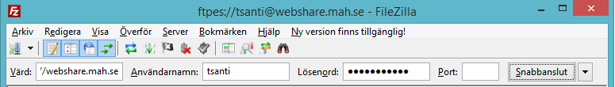
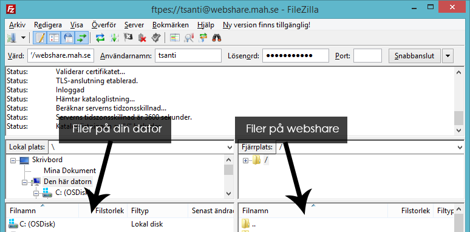

# Bootcamp - Del 1: En personlig webbsida

## 1. Inledning

Alla bör ha en personlig webbplats!

Som student på Malmö universitet har du automatiskt möjlighet att publicera webbsidor på internet. Det är vanligt att där skapa en startsida, med en presentation, kontaktinformation, länkar - och annat du känner för. Att skapa och publicera en egen presentationssida är alltså syftet för denna laboration!

### 1.1. Exempel

Såhär har några lärare och forskare vid institutionen för datavetenskap valt att göra med sina startsidor:

*   [Fredrik Ohlin](http://webshare.mah.se/ctfroh/)
*   [Bengt Nilsson](http://webshare.mah.se/tsbeni/)
*   [Paul Davidsson](http://webshare.mah.se/ctpada/)
*   [Marie Gustafsson Friberger](http://webshare.mah.se/ctmagu/)
*   [Anton Tibblin](http://webshare.mah.se/tsanti)

Som synes finns det en betydande variation i utformning, såväl visuellt som tekniskt. Testa öppna några av ovanstående sidor, och att i din webbläsare högerklicka på sidan och välja _visa källkod_ (eller motsvarande). Vilken av källkoderna är enklast/svårast att förstå?

Genom hela kursen webbapplikationer kommer snygg, läsbar och korrekt källkod att vara viktigt. Denna laboration börjar utforska vad det betyder.

## 2. Lärandemål

Denna laboration introducerar HTML, språket bakom mycket av webben. Det är en kärnkompetens inom modern informationsteknologi.

Efter genomförd laboration bör du:

*   ha en förståelse för vad HTML-taggar är och hur de används för att bygga upp webbsidor.
*   känna till de vanligaste elementen i HTML och deras syfte.
*   veta vad HTML5 innebär samt hur man kontrollerar sin kod gentemot denna standard.
*   ha publicerat en personlig webbsida som andra kan besöka!

## 3. Din webbsida

Din egna webbsida skapas genom att skriva källkod i HTML, HyperText Markup Language. Innan du börjar kan det vara bra att se över vilka verktyg och resurer som behövs.

### 3.1. Resurser

Du behöver några verktyg/resurser för att skapa din webbsida:

*   Ett bra textredigeringsprogram. Med “bra” menas framförallt att programmet stödjer [syntaxmarkering](http://en.wikipedia.org/wiki/Syntax_highlighting) för HTML - därutöver finns en mängd andra personliga preferenser.

    *   För Windows så medföljer Notepad (Anteckningar), för Mac OS X medföljer TextEdit (Textredigerare). Dessa är inte jättebra.
    *   På datorerna i labbsalen finns bland annat Visual Studio Code, Atom eller Brackets.
    *   För nedladdning till din egen dator finns otaliga alternativ. Några gratisvarianter är:
        *   **[VS Code](https://code.visualstudio.com/) (Windows, OS X, Linux)**
        *   [Atom](https://atom.io/) (Windows, OS X, Linux)
        *   [Brackets](http://brackets.io/) (Windows, OS X, Linux)
        *   [Notepad++](http://notepad-plus-plus.org/) (Windows)
        *   [Notepad2](http://www.flos-freeware.ch/notepad2.html) (Windows)
        *   [Sublime Text](http://www.sublimetext.com/) (Windows, OS X, Linux)
        *   [TextWrangler](http://www.barebones.com/products/textwrangler/) (OS X)
*   En referens för att slå upp hur HTML skrivs.

    *   w3School har en HTML-referens för olika HTML-element [w3School](http://www.w3schools.com/tags/)
    *   Sitepoint publicerar ett slags upppslagsverk för många aspekter kring HTML: [Sitepoint HTML Reference](http://reference.sitepoint.com/html).

### 3.2. Ett startdokument

#### 3.2.1 Om du använder en dator i skolan

Du kanske har noterat att det finns nätverksplats som heter Webshare (L:\) när du öppnar "Den här datorn" (om platsen inte finns måste du [aktivera tjänsten Webshare här](https://idservice.mau.se/)). Detta är en speciell plats, då alla filer som läggs där i automatiskt blir tillgängliga över internet. Om du redan provat att publicera filer via Webshare kan du hoppa till nästa rubrik. Annars bör du gå igenom följande steg för att testa på webbpublicering via Webshare:

En väldigt enkel webbsida är förberedd för er att använda. Källkoden för sidan är:


<!DOCTYPE html>
<html>
    <head>
        <meta charset="utf-8">
        <title>Min Webshare</title>
    </head>
    <body>
        <h1>Min Webshare</h1>
        

            Denna webbsida ska strax fyllas på med information.
        

    </body>
</html>


2. Skapa ett nytt dokument i t.ex. Notepad++ (t.ex. VS code, Atom, Notepad++, etc.) och klistra in ovanstående kod i dokumentet. Spara filen i din `Webshare`-plats, med filnamnet `index.html`.

3.  För att nu surfa in till sidan som ni precis publicerade, surfar ni till `http://webshare.mah.se/datorid`, där datorid är din egen datoridentitet.

4. Om du får felet `404 - File or directory not found` så betyder det att ingen fil med namnet index.html (eller index.htm) hittas. Använd i så fall utforskaren för att kontrollera att filen från steg 1 är sparad i nätverksplatsen `Webshare`. Börja om från steg 1 om du inte hittar filen alls. Om filen finns, men har fel filnamn - använd utforskaren rätta till namnet.

#### 3.2.2. Andra metoder för att komma åt hemkatalogen

Hemkatalogen går även att komma åt via krypterad FTP. FTP är ett protokoll specialdesignat för att skicka och ta emot filer (därav namnet, File Transfer Protocol). Adressen är `ftpes://webshare.mah.se` och ditt vanliga datorid och lösenord används. [FileZilla](https://filezilla-project.org/) (finns i datorsalarna) och [Cyberduck](https://cyberduck.io/) är två bra program som kan användas. Fråga gärna labbassistent om hjälp om detta är nytt för dig. Det finns även ett [webbgränssnitt](https://access.mah.se/) (men FTP rekommenderas starkt!).

##### Genom FTP (rekommenderat)

1. Ladda ner och installera [FileZilla](http://filezilla-project.org/).

2. Anslut till FTP-platsen webshare. Ange följande uppgifter:
    - Adress: *ftpes://webshare.mah.se*
    - Användarenamn: *ditt datorid till Canvas*
    - Lösenord: *ditt lösenord till Canvas*

3. Överför filer från din dator till webshare:

4. Om du nu överfört filen `index.html` till root-mappen i webshare, så kan du surfa till den genom följande adress: `http://webshare.mah.se/datorid`, där datorid är din egen datoridentitet.

{:.info}
Ser tecknet "å" konstigt ut när du öppnar webbsidan i webbläsaren? I så fall tolkas dokumentet på ett annat vis än det är sparat. Rekommenderad lösning: används "spara som" och ange Encoding/Teckenkodning till UTF-8. Mer om detta på föreläsningarna.
Öppna den nyss sparade filen i ett textredigeringsprogram - det är dags att lägga till ditt eget innehåll.

## 4. Mer innehåll, mer HTML

Nu när du har ett startdokument så kan det vara bra att repetera den grundläggande strukturen för HTML. Här finns artikel som kan vara bra att läsa:

1.  [Struktur för ett HTML-dokument](http://www.w3schools.com/html/html_intro.asp)

Med den genomgången är det dags för dig att fylla på med valfritt innehåll!

Ett förslag är att du tänker dig målgruppen _lärare och studenter vid Malmö högskola_ - vad vill dessa veta? Saker som kanske finns med på listan är ditt namn, vad du läser, en kort presentation av din bakgrund, kontakinformation, länkar till dina profiler på sociala nätverk, länkar till webbplatser som intresserar dig, bild(er) på dig eller något annat relevant, med mera. Det är förstås fritt att välja vad du inkluderar - men ju mer desto roligare.

Du bör också öva på att använda flera viktiga element i HTML. Förslagsvis bör din webbsida innehålla minst dessa (men även här - ju fler du övar på desto bättre):

<table>
    <thead>
        <tr>
            <th>Syfte</th>
            <th>Element</th>
            <th>Tutorial</th>
        </tr>
    </thead>
    <tbody>
        <tr>
            <td>Textstycke</td>
            <td><code>p</code></td>
            <td><a href="http://ia.webbintro.se/tutorials.php?type=HTML&title=Paragraphs">Tutorial</a></td>
        </tr>
        <tr>
            <td>Länk</td>
            <td><code>a</code></td>
            <td><a href="http://ia.webbintro.se/tutorials.php?type=HTML&title=Links">Tutorial</a></td>
        </tr>
        <tr>
            <td>Rubrik</td>
            <td><code>h1</code> - <code>h6</code></td>
            <td><a href="http://ia.webbintro.se/tutorials.php?type=HTML&title=Headings">Tutorial</a></td>
        </tr>
        <tr>
            <td>Punktlista</td>
            <td><code>ul</code> och <code>li</code></td>
            <td><a href="http://ia.webbintro.se/tutorials.php?type=HTML&title=Lists">Tutorial</a></td>
        </tr>
        <tr>
            <td>Bild</td>
            <td><code>img</code></td>
            <td><a href="http://ia.webbintro.se/tutorials.php?type=HTML&title=Images">Tutorial</a></td>
        </tr>
        <tr>
            <td>Betonad text</td>
            <td><code>em</code></td>
            <td><a href="http://ia.webbintro.se/tutorials.php?type=HTML&title=Paragraphs">Tutorial</a></td>
        </tr>
        <tr>
            <td>Starkt betonad text</td>
            <td><code>strong</code></td>
            <td><a href="http://ia.webbintro.se/tutorials.php?type=HTML&title=Paragraphs">Tutorial</a></td>
        </tr>
    </tbody>
</table>

Så, vidareutveckla din webbsida - kontrollera ofta med webbläsaren att du får förväntat resultat. Du är färdig när du tycker att rätt information är inkluderad, men rätt val av HTML-taggar. (Ett tips är att experimentera mycket - allt behöver inte tas med i “slutversionen” av din webbsida.)

Först i nästa laboration kommer fokus ligga på att anpassa presentationen. Du får gärna utforska stilmallar och <abbr title="Cascading Style Sheets">CSS</abbr> på egen hand, men tanken är att webbläsarens standardsutseende fungerar bra så länge.

## 5. Validera din kod

Det är lätt att göra misstag, så även när man skriver HTML5\. Använd därför en tjänst hos W3C för att validera dokumentet. Validatorn söker igenom ditt dokument efter misstag och talar om för dig vad som är fel om den hittar något. Validatorn hittar du på [validator.w3.org](http://validator.w3.org/).

Ett bra dokument saknar fel (som rödmarkeras i validatorn) - och helst även varningar.

## 6. Feedback

Hur ska du veta om du skapat bra eller dålig HTML? Kontrollera först följande punkter:

*   Validerar webbsidan?
*   Är källkoden lätt att läsa?
*   Har du valt element som bra beskriver innehållet? (Exempelvis `p` för alla textstycken, `ul`/`li` för punktlistor, osv.)

Din labbhandledare hjälper gärna till med feedback! Bäst är att be henne/honom kika på din källkod - både för utesluta att du missförstått något, och för att tipsa om förbättringar som kan göras.

Du kan även passa på att dela länken till din webbplats (länken till din `webshare`) till någon av dina kursare - så kan de surfa in på din webbsida och beskåda din nya webbplats! =)

* * *

**Lycka till!**
