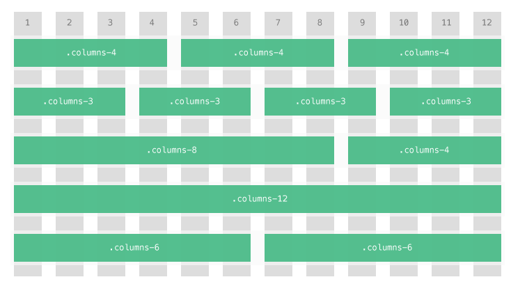
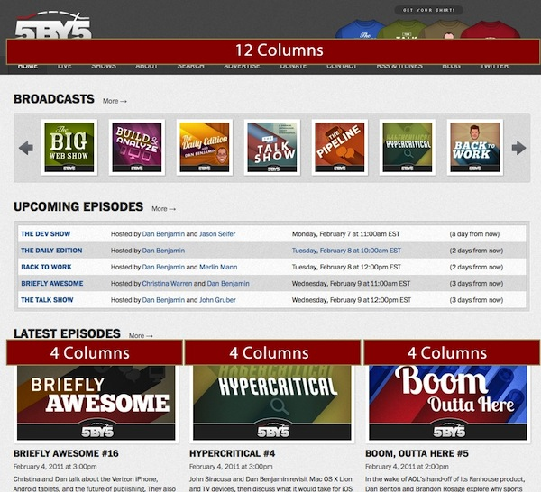
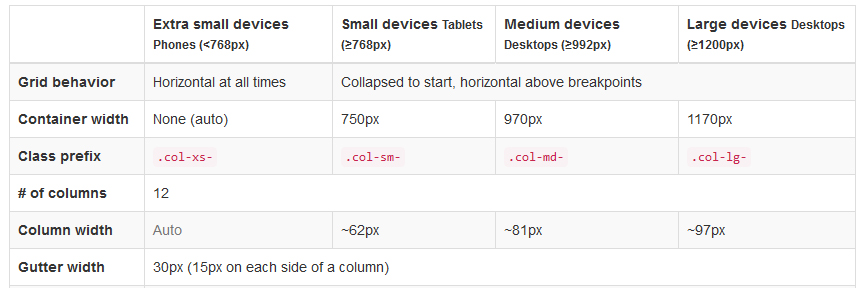
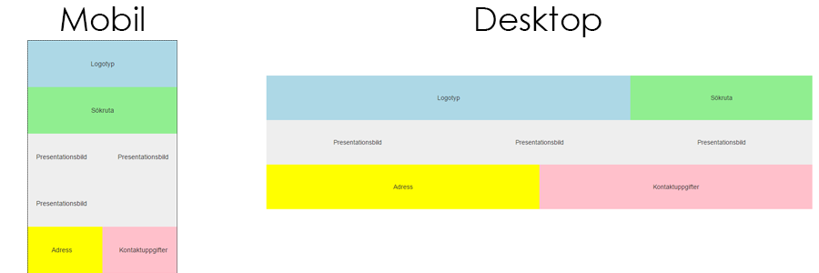

# Laboration 7: Responsiva ramverk

## 1. Introduktion

När det kommer till programmering eller webbutveckling så är det inte alltid så att man behöver uppfinna hjulet varje gång man vill bygga något. Även om det ofta är väldigt roligt att bygga saker själv från grunden är det ofta tidskrävande och dyrt. Därför ska vi i denna laboration titta på färdiga ramverk som man kan använda sig utav när man vill utveckla responsiva webbplatser.

Det finns en hel uppsjö utav dessa ramverk, men tre av dessa som används flitigt är:

1. [Bootstrap](http://getbootstrap.com)
2. [Foundation](http://foundation.zurb.com/)
3. [Materialize](http://materializecss.com/)

Vad dessa ramver har gemensamt är bland annat att:

- De använder ett rutnätssystem (grids) för att bygga layouter
- De har olika "komponenter" för att förbättra de grafiska gränssnittet (allt från knappar, formulär, till tabeller och bildvisning)
- JavaScript-tillägg, t.ex. modals, popovers, show/hide content, etc.

Titta gärna runt på dessa tre alternativ ovan (eller om du har hört gott om något annat alternativ, så titta gärna på det) innan vi går vidare, så att ni får en bild av vad dessa kan erbjuda.

## 2. Gridsystem för layout

Att skapa en layout till en webbplats kan lösas på en mängd olika vis. För att förenkla denna processen kan man förhålla sig till något som kallas ett "gridsystem", kort kan detta beskrivas som en uppsättning CSS regler som är återanvändbara. Det vill säga att för varje ny webbplats man skapar kan man nyttja samma mall för att strukturera upp en ny layout. Notera att det handlar om själva strukturen och inte designen.

Ett exempel på just ett sådant gridsystem som är populärt idag är "12 kolumns layout". Denna layout utgår ifrån att vi delar in sidan i 12 kolumner och utefter dessa strukturerar vi upp vårat innehåll i form av rader (tänk dig en tabell).

För att skapa förståelse för hur ett gridsystem fungerar - och kan byggas själv - kommer nedan en snabb introduktion till att skapa ett gridsystem. Tanken är dock att ni sedan ska använda ett färdigt gridsystem från något utav ramverken.

### 2.1. Skapa eget gridsystem

*Detta är inget som måste göras på labben, men det är bra om det grundläggande tänket bakom grid-system. Så läs igenom det så att ni har koll på läget.*

För att skapa vår egen version av ett sådant gridsystem kommer vi huvudsakligen arbeta med tre delar: box modellen, `float` och `clear`, samt `
` elementet (för att gruppera).

För att göra det enkelt för oss kan vi börja med vårt HTML dokument. I detta exempel kommer vi utgå ifrån att vi på vår sida har tre kolumner med lite text i varje. Vid första anblick kommer detta kännas främmande men tillsammans med CSS blir det förhoppningsvis enklare att förstå.


<!-- Vår yttersta 
 representerar en rad. -->

    <!--
        Nedan har vi tre 
 element som representerar
        de tre kolumner vi ville ha på vår sida. Tänk
        inte på klassernas namn ännu.
    -->
    

        

            The ideas of my friend Watson, though
            limited, are exceedingly pertinacious.
        

    

    

        

            For a long time he has worried me to
            write an experience of my own.
        

    

    

        

            Good old Watson! You are the one fixed
            point in a changing age.
        

    



I våran mall börjar vi med vår `
` som representerar en rad på vår sida. I denna rad har vi våra tre kolumner med varsin paragraf. Anledning till att jag valt att döpa klasserna till "columns-4" är att om vi har en 12-kolumns-layout och vi har tre kolumner kommer varje kolumn sträcka sig över fyra layout kolumner. Detta är med stor sannolikhet ganska förvirrande men ta en titt på Figur 1 och observera namnen på klasserna och hur de relaterar till layout kolumnerna (de gråa staplarna).

 _Figur 1. Gridsystem i form av 12-kolumns-layout._

Återigen - siffran i klassen representerar antalet gråa staplar i bilden. För att ytterligare demonstrera hur detta används kan vi analysera två webbplatser genom att markera vart de har använt ett gridsystem, ta en titt på Figur 2 och 3.

 _Figur 2. Gridsystem exempel 1._

 _Figur 3. Gridsystem exempel 2._

Nästa steg är att skapa vår CSS mall för vårt gridsystem. Eftersom vi vill att våra rader (eng. rows) ska vara horisontella kommer vi använda attributen `float` och `clear` för att åstadkomma detta. För att kunna skapa ett gridsystem måste man även bestämma en bredd för webbplatsen, för att göra detta enkelt för er utgår vi ifrån 960 pixlar (väldigt vanligt idag). Anledningen till detta är att vi vill ha en centrerad webbplats och därför måste vi ange en bredd. Därmed kan vi utöka tidigare HTML mall med följande:



    <!-- Placera föregående HTML mall här. -->



Vidare så skapar vi vår första del av vårat gridsystem såhär:


.wrapper {
    width: 960px;
    /*
        Automatisk marginal åt vänster/höger innebär att om vårt
        element har en bestämd bredd så kommer det centreras.
    */
    margin: 0 auto 0 auto;
}

/*
    Den klass som används för att skapa en "rad", dvs
    där vi placerar våra olika kolumner.
*/
.row {
    clear: both;
}
.row:after {
    content: "";
    display: table;
    clear: both;
}

.columns-4 {
    /*
        För att åstadkomma ett horisontellt flöde används
        "float" för att samtliga element ska positioneras
        åt vänster.
    */
    float: left;
    /*
        Vi använder margin/padding för att ge lite mer luft
        till vårt innehåll.
    */
    margin: 10px;
    padding: 10px;
    /*
        Vi måste ange en bredd som representerar 4 layout kolumner.
        Mer om denna uträkningen finner ni nedan.
    */
    width: 280px;

    /* För att visuellt se detta anger vi en temporär bakgrundsfärg. */
    background: #eeeeee;
}


En viktig punkt när vi skapar dessa klasser är att vi måste räkna ut en bredd som representerar antal layout kolumner. I ovanstående exempel har vi bredden 280 pixlar och detta skulle representera fyra gråa staplar i Figur 1. Det finns givetvis en liten formel för att räkna ut denna bredd, observera att efter ni skapat de tolv klasser som behövs för ett komplett gridsystem behövs detta inte göras igen.

I vårt exempel utgår vi från en bredd på 960 pixlar, detta innebär att _en_ grå stapel är 80 pixlar (960 / 12 = 80). I vårat fall hade vi fyra gråa staplar, det vill säga 4 * 80 = 320. Detta stämmer inte precis överens om med vårt resultat (280), anledningen till detta är att när du räknat ut bredden (320) måste man räkna bort attributen `margin`, `padding` och `border` i vänster samt höger riktning. I vårt exempel hade vi `margin: 10px;` vilket är 10 pixlar åt vänster och höger, summa: 20. Samma sak för `padding: 10px`, summa: 20. Om vi subtraherar dessa summor med 320 får vi 280, detta är den bredd vi anger i CSS.

Formeln för att räkna ut den bredd som anges i CSS är följande (förutsatt en bredd på 960 pixlar): `80 * (antal gråa staplar) - (margin + padding + border)`. Använd kalkylatorn nedan för att se vilket resultat ni får.
{: .info}

<form id="grid-calculator" action="" method="get">
    <input type="number" id="grid-width" placeholder="Sidobredd" value="960">
    80
    &times;
    <select id="grid-columns">
        <option value="1">1</option><option value="2">2</option>
        <option value="3">3</option><option value="4">4</option>
        <option value="5">5</option><option value="6">6</option>
        <option value="7">7</option><option value="8">8</option>
        <option value="9">9</option><option value="10">10</option>
        <option value="11">11</option><option value="12">12</option>
    </select>
    <input type="number" id="grid-margin" placeholder="Margin">
    <input type="number" id="grid-padding" placeholder="Padding">
    <input type="number" id="grid-border" placeholder="Border">
    =
    80
</form>

För att fortsätta med att testa vårt gridsystem kan vi ändra vår HTML mall till följande:


<!-- Fyll på med eget innehåll. -->

    <!--
        Vi använder oss utav två rader,
        en med tre kolumner och en med två.
    -->
    

        

        

        

    

    

        

        

    




.wrapper {
    width: 960px;
    margin: 0 auto 0 auto;
}

/*
    Den klass som används för att skapa en "rad", dvs
    där vi placerar våra olika kolumner.
*/
.row {
    clear: both;
}
.row:after {
    content: "";
    display: table;
    clear: both;
}

/* Gemensam mall för alla våra kolumner. */
.columns-4,
.columns-6 {
    float: left;
    margin: 10px;
    padding: 10px;

    /* För att visuellt visa hur det ser ut. */
    background: #eeeeee;
}

/* De individuella bredderna för våra kolumner. */
.columns-4 {
    width: 280px;
}
.columns-6 {
    width: 440px;
}


Med utgångspunkt i ovanstående exempel och det som presenterats borde ni ha kunskap nog att fortsätta med detta gridsystem för att fylla på med alla klasser (1-12). Experimentera!

Anledningen till att just detta vis att arbeta med layouter presenteras är för det är ett vedertaget system i dagens industri. Ett bra exempel på detta är de två ledande CSS ramverken (ett ramverk är egentligen bara en stor återanvändbar CSS mall) [Bootstrap](http://getbootstrap.com), [Foundation](http://foundation.zurb.com/) och [Materialize](http://materializecss.com/). Dessa ramverk har en utgångspunkt i sitt gridsystem som är till ytan mycket likt vårat, besök sidorna och ta en titt!

## 3. Gridsystem i de olika ramverken

[Gridsystemet i bootstrap](http://getbootstrap.com/css/#grid) tillför mer funktionalitet än det vi tittat på ovan. I exemeplet ovan har vi endast desktop som mål, då vi bestämmer en exakt bredd på våra "kolumner". Vi vill ju istället använda gridsystemet för att ha mobil, tabelet och desktop som mål. Detta möjliggör bootstrap.

De har olika klasser för hur olika kolumner ska visas för olika enheter, så att vi kan bestämma t.ex. att två kolumner ska ligga bredvid varandra (ha en bredd på 6) för desktop och tablet, medan de ska ligga under varandra för mobil (ha en bredd på 12). För att se hur man kan ha olika enheter som mål så kan vi studera deras översiktstabell.

 _Figur 4. Här kan vi se att vi använder olika prefix för olika mål (mobil/tablet/mindre dektop/större desktop)._

### 3.1. Exempellayout i bootstrap

Låt säga att vi nu vill göra en enkel layout, som ska innehållande

- Ett sidhvuvud
  - Titel på sidan
  - Sökruta
- Plats för innehåll
  - Tre kolumner med information
- Sidfot
  - Adresskolumn
  - Kontaktkolum

Vi kan nu använda bootstraps gridsystem för att göra detta, så att vi anpassar det efter olika eneheter. I detta exemplet anpassar vi bara specifik till mobil och desktop. För mobilsidan ska sidhuvudets kolumner ligga under varandra (titel/sökruta) medan för desktop ska de ligga bredvid varandra där titeln är 8/12 av sidans bredd medan sökrutan är 4/12 bred. För mobilsidan ska kolumnerna ligga två och två, medan för desktop ska de ligga tre och tre. I båda fallen ska adress- och kontaktkolumnen ligga bredvid varandra. Vi vill alltså att det ska se ut något i stil med:

 _Figur 5. Exempellayout i bootstrap_

Vår källkod för detta ser ut på följande sätt:


<!doctype html>
<html>
  <head>
    <meta charset="utf-8">
    <meta name="viewport" content="initial-scale=1, width=device-width">
    <title>Bootstrap test</title>
    <!-- Boostrap CSS: Latest compiled and minified CSS -->
    <link rel="stylesheet" href="https://maxcdn.bootstrapcdn.com/bootstrap/3.3.6/css/bootstrap.min.css" integrity="sha384-1q8mTJOASx8j1Au+a5WDVnPi2lkFfwwEAa8hDDdjZlpLegxhjVME1fgjWPGmkzs7" crossorigin="anonymous">
    
  </head>
  <body>
    

      

        <!-- 12 i bredd för mobiler, 8 i bred för desktop -->
        
Logotyp

        <!-- 12 i bredd för mobiler, 4 i bred för desktop -->
        
Sökruta

      

      

        <!-- Varje kolum har en bredd på 6 för mobiler, 4 för desktop -->
        
Presentationsbild

        
Presentationsbild

        
Presentationsbild

      

      

        <!-- Kolumnerna har alltid 6 i bredd -->
        
Adress

        
Kontaktuppgifter

      

    

  </body>
</html>


*Tänk på att* om det inte finns någon specifik kolumnbredd angiven för en enhet (`xs`, `sm`, `md`, `lg`) så används kolumnbredden som är angiven för alternetivet minde (t.ex. `sm` får `xs` kolumnegenskaper om `sm` inte har någon kollumnbredd definierad).
{: .info}

För bättre förståelse kring hur man kan använda gridsystemet så rekommenderar jag att ni läser mer i [bootstraps dokumentation om grids](http://getbootstrap.com/css/#grid).

### 3.2. Foundation & Materialize

Upplägget är samma, även om syntaxen är något annorlunda. Har ni förstått poängen kring grids ovan är det inga problem att läsa in sig på dessa ramverken.

- [Dokumentation för grids i Foundation](http://foundation.zurb.com/sites/docs/grid.html)
- [Dokumentation för grids i Materialize](http://materializecss.com/grid.html)

## 4. Övningar

### 4.1. Layout med grids

Som övningsuppgift ska ni skapa en komplett webbplats där layout och struktur styrs genom det gridsystem som finns tillgängligt i något utav de nämnda ramverken. Detta innebär att ni behöver följa den dokumentation som finns på valt ramverks webbplats, tveka inte att ställa frågor om ni har några. De två krav som ställs är följande:

* Layout och struktur styrs genom ett gridsystem.
* Webbplatsen måste ha komplett innehåll gällande text och grafik, dvs. är det inte tillåtet att använda "lorem ipsum" och dylikt. Dock är det tillåtet att kopiera text samt grafik från webben (för att vi i denna övning ska få lite vettigt innehåll).

För att underlätta processen kommer det nedan presenteras ett fåtal exempel på strukturer som kan följas, välj *en* av dessa (men ni kan såklart skapa en *egen* layout för er webbplats om önskar det). Observera att ett gridsystem kan skapas på ett flertal olika vis, så länge du själv förstår vad som sker och du finner det enkelt så är det med stor sannolikhet korrekt!

**Fundera även på hur dessa ska fungerar i en mobiltelefon - och implementera även detta**

 _Figur 6. Struktursexempel 1_

 _Figur 7. Struktursexempel 2_

 _Figur 8. Struktursexempel 3_

### 4.2. Remake av labb 3

Nu ska ni göra om ert resultat från labb 3 till att använda sig utav grid-system. När ni gjort detta så reflektera över följande:

- Vilket tyckte ni var enklast att arbeta med? Varför?
- I vilka lägen bör man använda färdiga grid-system, i vilka lägen bör man undvika dessa?

Här kommer bilderna återigen på hur er webbplats kan se ut (det måste inte följa detta till punkt och pricka, men grundtanken):

 _Figur 9. Exempelutseende för desktop_

 _Figur 10. Exempelutseende för tablet_

 _Figur 11. Exempelutseende för mobil_

## 5. Nu då?

När ni börjat få pejl på grid-systemen så finns det massor utav andra bra saker med de olika ramverken, t.ex. inbyggd styling. Titta gärna på följande komponenter:

- Knappar: [Bootstrap](http://getbootstrap.com/css/#buttons), [Foundation](http://foundation.zurb.com/sites/docs/button.html) [Materialize](http://materializecss.com/buttons.html)
- Formulär: [Bootstrap](http://getbootstrap.com/css/#forms), [Foundation](http://foundation.zurb.com/sites/docs/forms.html) [Materialize](http://materializecss.com/forms.html)
- Tabeller: [Bootstrap](http://getbootstrap.com/css/#tables), [Foundation](http://foundation.zurb.com/sites/docs/table.html) [Materialize](http://materializecss.com/table.html)
- Olika JavaScript-componenter: [Bootstrap](http://getbootstrap.com/javascript/), [Foundation](foundation.zurb.com/sites/docs/), [Materialize](http://materializecss.com/)

Titta gärna på länkarna ovan och berika era webbplatser med det ny tycker ser bra ut!

## 6. Andra bra länkar

* [All About Floats][css floats]
* `position` [referens][css position]
* [The Magic of CSS][magic of css]
* [Bootstrap][bootstrap]
* [Foundation][foundation]
* [Don't Overthink It Grids][csstricks]

[css floats]: http://css-tricks.com/all-about-floats/
[css position]: https://developer.mozilla.org/en-US/docs/Web/CSS/position
[magic of css]: http://adamschwartz.co/magic-of-css/
[bootstrap]: http://getbootstrap.com/
[foundation]: http://foundation.zurb.com/
[csstricks]: http://css-tricks.com/dont-overthink-it-grids/

