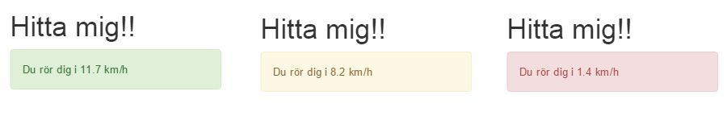

# Laboration 9 - Geolocation

I denna labb ska vi titta på hur vi kan använda enhetens GPS (alternativt mobiltäckning/wifi) för att bestämma den aktuella positionen för enheten. Vi kommer att göra detta i olika steg:

1. Ta reda på information om vår plats
2. Ta reda på när vi byter plats
3. Visa hur fort vi rör oss

## 1. Ta reda på data om vår plats

### getCurrentPosition

Innan man kan bygga några roliga applikationer som baserar sig på plats-data, så behöver vi ta reda på var vi är någonstans. Detta görs genom (JavaScript):

```javascript
/*
  Hämtar vår nuvarande plats

  Parametrar:
  - Funktionen: "onSuccess" körs om vi lyckas hitta vår position,
  samt att användaren godkänner att vi tar del av positionen
  - Funktinen: "onFail" körs om vi misslyckas (av någon anledning),
  - Objektet: "{}" ger oss möjlighet att skicka med skicka med
  alternativ till funnktionen.
*/

navigator.geolocation.getCurrentPosition(onSuccess, onFail, {});

function onSuccess(position){
  // "position" är ett objekt som innehåller vår platsinfo
  // Vi loggar var position (titta i loggen vad som händer)
  console.log(position);
}

function onFail(){
  alert("Vi kunde tyvärr inte hämta din plats just nu.");
}
```

[Bra dokumentation om funktionen finns här](https://developer.mozilla.org/en-US/docs/Web/API/Geolocation/getCurrentPosition)

Teskör koden ovan på en webbsida, titta i loggen och svara på följande frågor:

1. Vilka två egenskaper har objektet ["position"](https://developer.mozilla.org/en-US/docs/Web/API/Position) som vi loggade?
2. Vilka olika värde kan ni få ut kring er position från ["coords"](https://developer.mozilla.org/en-US/docs/Web/API/Position/coords)-objektet?

Visa nu upp information kring vår nuvarande plats för användare, något i stil med:


## Del 2: Ta reda på när vi byter plats

### watchPosition

Nästa del blir att göra så att webbsidan uppdaterar positions-egenskaperna när vi rör oss. Till vår hjälp här har vi funktionen `watchPosition`. Ett exempelanrop för att köra denna position skulle kunna vara:

```javascript
navigator.geolocation.watchPosition(onSuccess, onFail, {
  enableHighAccuracy: true, // Försök tvinga enheten till så precis position som möjligt
  timeout: 5000, // Maximal tid (milisekunder) som enheten har på sig att reuturnera positionen
  maximumAge: 0 // Hur länge positionen får cachas (milisekunder)
});
```

[Bra dokumentation om funktionen finns här](https://developer.mozilla.org/en-US/docs/Web/API/Geolocation/watchPosition)

Lägg nu upp denna sida på webshare/dvwebb, surfa till mobilen och se hur värdena ändras när ni springer runt med mobilen. Det kan se ut såhär, t.ex.

 **Här gör jag en liten rush utanför gäddan och vi kan se att jag rör mig cirka 4.8m/s (drygt 17km/h), tro det eller ej!**

Nu är der er tur att se hur ni röra er! =)

## Del 3: Visa användaren hur snabbt denna rör sig

Ni ska i sista uppgiften berätta för användaren hur snabbt denna rör sig, och ge feedback i tre olika färger:

- Röd = Långsamt (< 5km/h)
- Gul = mellan (> 5km/h, < 10km/)
- Grön = snabbt (> 10km/h)

JavaScript API:t returner *meter per sekund* men vi vill för användaren visa hurr *km per timme*. använd följande formel för att åstakomma detta:

```
1 meter per sekund = 3,6 kilometer per timme
```

Nu ska vi visa upp resutltat i stil med:



**När ni fått det att fungera, så gå ut en sväng och testa! Att sitta inne i gäddan gör ofta att precisionen blir så låg att den data som er webbsida ger er blir smått oanvändbar**
