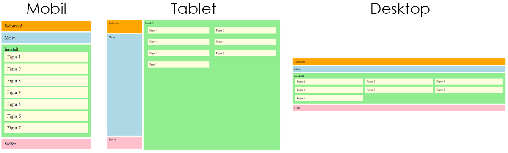

# Laboration 3: Responsiv webbutveckling

I denna laboration vi bygga vår första responsiva webbplats. Målet är att skapa en webbsida som anpassar sig utefter datorer, surfplattor och mobiltelefoner.

## 1. Uppgift

Vi ska nu bygga en webbsida, med valfritt innehåll. Vi tänker bygga vår enligt Star Wars-tema, eftersom det är den bästa filmen som någonsin gjorts. Eftersom ni kanske inte tycker det, så är det helt okej att välja ett annat tema, lämpligen något som fångar ert intresse.

Vi borde börja att fundera på hur vår webbsida ska se ut, och vilka delar som sidan ska struktureras upp av.

Denna labb kommer att föreslå olika layouter och designval kring den webbsida som ska skapas. Detta är alltså **förslag**, som framförallt riktar sig till de som inte är efarna med responsiv design. Vill du istället göra annorlunda så är det fritt fram!
{: .info}

## 2. Att tänka responsivt

Vi har som mål att oavsett vilken enhet som användaren väljer att besöka vår webbplats genom - så ska de få en så bra upplevelse som möjligt. Vi pratade på föreläsningen om att använda "boxar" för att strukturera upp vårt innehåll på webbplatsen. Vi tänker oss att huvudelementen på sidan är följande:

- Sidhuvud
- Meny
- Innehåll
- Sidfot

Vi tänker även att startsidan ska ha några figurer med tillhörande text, i vårt fall för att marknadsföra de filmer som ingår i filmserien (här kan ni välja att presentera valfri information som relaterar till er webbplats.) En enkel struktur på sidan skulle således kunna se ut något i stil med:



Större versioner av bilderna hittar du här: [Överblick](5/wireframes.png), [Mobile](5/mobile-wireframe.png), [Tablet](5/tablet-wireframe.png), [Desktop](5/desktop-wireframe.png). *Notera att de vita mellanrummen mellan de olika delarna på sidan är för att tydligt visa deras gränser, och behöver inte återskapas senare i labben*.

Vi kommer i denna labb utgå från det klassiska sättet att bygga upp layoter, genom CSS-egenskapen `float`. Det är helt okej (eller till och med att föredra i dagens labb) att istället använda sig av `grids` för den övergripande layouten och `flexbox` för placering av innehåll. Mer information och bra guide kring flexbox hittar ni [här](https://css-tricks.com/snippets/css/a-guide-to-flexbox/), och för grids [här](https://css-tricks.com/snippets/css/complete-guide-grid/). Det bästa är ju naturligtvis att bygga layouterna i de olika tenkikerna för att lära sig för- och nackdelar med de olika teknikerna.
{: .info}

### 2.1. Mobile first

Vi pratade på föreläsningen om att börjar designa den mobila version av webbplatsen, då det ofta kan vara svårare att i efterhand skala ner än skala upp en webbplats. Dessutom brukar den mobila versionen vara lite enklare, då man har mindre spelrum i hur mycket man kan ta ut svängarna. Tänk nu över hur en ev. källkod skulle kunna se ut för att lyckas åstakomma ovanstående layouts genom att enbart lägga till CSS-kod.

Tips! Börja att ta fram de element som bör användas, för att sedan bestämma hur dessa ska ligga i förhållande till varandra.
{: .info}

<details>
  <summary>När ni tänkt klart kan ni jämföra men den källkod som vi använde.</summary>
  
<!doctype html>
<html>
  <head>
    <meta charset="utf-8">
    <meta name="viewport" content="initial-scale=1, width=device-width">
    <title>Star Wars</title>
    <link href="style.css" rel="stylesheet">
  </head>
  <body>
    <div id="wrapper">
      <header>
        Sidhuvud
      </header>
      <nav>
        Meny
      </nav>
      <main>
        Innehåll
        <figure>Figur 1</figure>
        <figure>Figur 2</figure>
        <figure>Figur 3</figure>
        <figure>Figur 4</figure>
        <figure>Figur 5</figure>
        <figure>Figur 6</figure>
        <figure>Figur 7</figure>
      </main>
      <footer>
        Sidfot
      </footer>
    </div>		
  </body>
</html>

</details>

#### 2.1.1. Färgläggning utav layouten

Nu är det dags att färglägga våra element, enligt bilderna ovan. Det är bra att göra detta innan vi går vidare och lägger in mer innehåll - så att vi har koll på att allt ser ut, innan vi börjar fylla på med information. Tänk på att strukutera upp er CSS-fil så att ni har koll på vilka CSS-egenskaper som gäller vilka målenheter, t.ex. denna uppdelning:

- Generella egenskaper (typsnitt, gemensamma färger, etc.)
- CSS för mobiltelefoner
- CSS för tablets
- CSS för desktop

Det skulle kunna se ut något i stil med:
```css
/*
  Här skiver ni generella egenskaper
*/

@media screen and(max-width:480px){
  /*
    Egenskaper för mobiler
  */
}

@media screen and (min-width: 480px) and (max-width: 1024px){
  /*
    Egenskaper för tablets
  */
}

@media screen and (min-width: 1025px){
  /*
    Egenskaper för desktop
  */
}
```

Tänk på att webbläsarna har  *förbestämda* CSS-egensker för olika element (t.ex. rubriker, paragrafer, etc.). Detta kan man nollställa genom s.k. *CSS-reset*, exempel på en sådan kan du hitta [här](http://meyerweb.com/eric/tools/css/reset/).
{: .info}

Kontrollera sedan att webbsidan fungerar som förväntat, t.ex. genom att besöka den genom din mobiltelefon eller genom [Chromes utvecklingskonsol](https://developer.chrome.com/devtools) där du kan klicka på den lilla *telefonen* i utvecklingsverktygets fält uppe till vänster. Skulle det vara några konstigheter här så fråga läraren om tips & trix.

<details>
  <summary>När ni fått allt att fungera som det ska, kan ni jämföra med vår version av CSS-koden. <strong>OBS.</strong> Vi har använt oss av <a href="5/reset.css">denna reset</a>.</summary>
  
#wrapper{
  overflow: hidden;
}
header{
  background-color: orange;
}
nav{
  background-color: lightblue;
}
main{
  background-color: lightgreen;
}
figure{
  background-color: lightyellow;
}
footer{
  background-color: pink;
}

@media screen and (max-width:480px){
  body{
    margin: 5px;
  }
  header, nav, main, figure, footer{
    padding: 10px;
    margin-bottom: 5px;
  }
}

</details>

Nu borde det se ut något i stil med:


Glöm inte att inkludera `viewport`-egenskaper, så att webbsidan visas korrekt i mobiltelefoner!
{: .info}

### 2.2. Tablet second

När vi lyckats få till vår layout för mobilversionen utav vår webbplats är det dags att ta tag i tablet-versionen. Här tänkte vi nu introducera två nya sätt att positionera element i webbläsaren, nämligen positionering genom **fixed**, och då passar vi på att även nämna **absolute**.

Både CSS-egenskapen `position: absolute` och `position: fixed` innebär att man placerar ett HTML-element på en absolut plats i förhållande till webbläsarfönstret (eller elementets förälder). Skillanden är att `position: fixed` är som "fastklistrad" på skärmen (när man skrollar så stannar den kvar på samma plats, och berörs alltså inte utav skrollningen). Detta passar ju jättebra till vår meny som vi **alltid** vill ha tillgänglig till vänster i var tablet-version. Element med `position: absolute` "följer med" när man skrollar på webbsidan och lämpar sig då till vår innehållskolumn till höger på webbsidan. Alltså:

- Sidhuvud: `position: fixed`
- Meny: `position: fixed`
- Sidfot: `position: fixed`
- Innehåll: oförändrad

**Sidhuvudet** skulle kunna vara 20% bred och 10% hög, alltså ligga högst uppe till vänster på skärmen.

**Menyn** skulle kunna vara 20% bred och 80% hög, samt ha 10% till toppen av webbläsaren (`top: 10%`) alltså ligga under sidhuvudet till vänster på vår sida.

**Sidfoten** skulle kunna vara 20% bred och 80% hög, samt ha 90% till toppen av webbläsaren (`top: 90%`) alltså ligga under menyn, längst ner till vänster på vår sida.

**Innehållet** skulle då kunna vara 80% bred där höjden anpassar sig efter innehållet, och ligga till höger på vår sida.

Då borde vi ha fixat till vår layout får vår tablet också!

<details>
  <summary>Vår lösning hittar ni här (adderas till befintlig CSS-kod)</summary>
  
@media screen and (min-width: 480px) and (max-width: 1024px){
  body{
    background-color: lightgreen;
  }
  header, nav, main, figure, footer{
    padding: 10px;
  }
  header{
    position: fixed;
    width: 20%;
    height: 10%;
    padding: 10px;
  }
  nav{
    position: fixed;
    width: 20%;
    top: 10%;
    bottom: 10%;
  }
  main{
    width: 80%;
    float: right;
  }
  figure{
    margin: 2%;
    width: 46%;
    float: left;
  }
  footer{
    position: fixed;
    width: 20%;
    height: 10%;
    top: 90%;
  }
}
  
</details>

Nu borde det se ut något i stil med:


### 2.3. Desktop third

Nu är det dags bygga ihop den sista vyn, alltså när man surfar in genom en dator. Denna del lämnar vi till er - det borde ni fixa vid detta laget, och när ni är klara borde det se ut något i stil med:


## 3. Att snygga till sin webbplats

När vi är nöjda med hur vår grundläggande struktur ser ut på vår webbplats är det dags att lägga till lite innehåll på webbplats! Vi tänker oss att vi lägger till följande:

- Sidhuvud
  - En titel på webbsidan
  - En ev. logotyp som man vill
- Meny
  - Minst 4st meny-alternativ (tänk på att menyalternativen ska vara enkla att klicka på när man surfar in med en mobiltelefon/tablet). Länkarna kan dock fejkas, de behöver inte leda någonstans.
- Innehåll
  - En beskrivande text om webbsidan
  - Några figurer/bilder med bildtexter som representerar er webbplats innehåll
- Sidfot
  - Vem som gjort sidan, el. liknande

### 3.1. Mobilversionen

Vi tänker oss att det skulle kunna se ut någonting i stil med:


#### Tips

- För att få länkarna (`<a>`-elementen) under varandra, använd egenskapen `display: block`
- För att bilderna inte ska bli större än föräldra-elementet, använd egenskapen `max-width: 100%`
- För att göra element lika breda som webbläsarfönstret, använd egenskapen `width: 100%`
- För att inkludera ev. `border` och `padding` i den totala bredden för ett element, använd egenskapen `box-sizing: border-box`

### 3.2. Tabletversionen

Vi tänker oss att det skulle kunna se ut någonting i stil med:


#### Tips

- Anta att ert sidhuvud/sidfot är 10% höga (av webbläsarens höjd). För att få er text centrerade vertikalt i dessa element, ange (för texten) egenskapen `line-height: 10vh` (10vh motsvarar en radhöjd för 10% av webbläsarens höjd = lika hög som sidhuvud/sidfot)
- För att lägga bilderna (som ju ligger i `<figure>`-element) bredvid varandra, ange för `<figure>` t.ex. en bredd på 46%, en marginal åt alla håll på 2% (blir ju totalt 50%) och använd sedan egenskapen `float: left` för att de ska hamna bredvid varandra.

### 3.2. Desktopversionen

Vi tänker oss att det skulle kunna se ut någonting i stil med:


## Nu då?

Det finns mycket roligt kvar att göra för att snygga till vår webbplats ännu mer! Här kommer några förslag som kan vara roligt att pyssla med:

- Ange en snyggare font, som du hämtar från [Google fonts](https://www.google.com/fonts)
- Gör så att era figurer får rundade hörn genom egenskapen [`border-radius`](http://www.w3schools.com/cssref/css3_pr_border-radius.asp)
